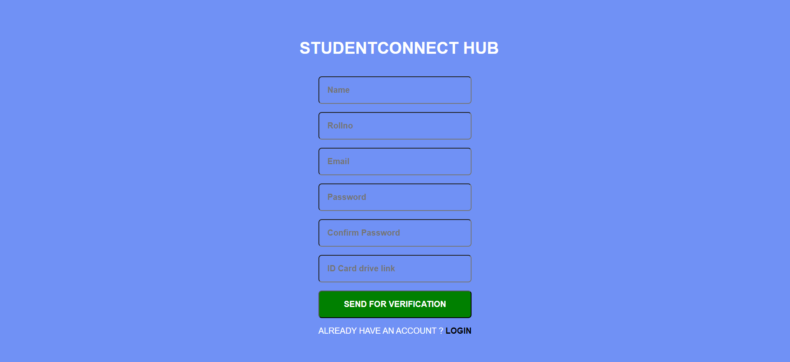

# StudentConnect-Hub
StudentConnect Hub - streamlined web app enabling students to report issues and monitor progress eficiently.

### Some features:
1. Students can register by submitting ID card PDF and roll number, awaiting approval from higher authorities after verification.
2. On the student dashboard, three main options are available: Dashboard,Complaint Now,Track.
3. The dashboard section displays comprehensive statistics, including the total number of submitted complaints, unsolved, resolved complaints, and those at the last level of resolution. Additionally, it provides an illustrative bar chart offering in-depth status of the complaints.
3. In the 'Complaint' section, students can report problems like hostel or mess issues. They pick a category and describe the problem, and it goes to the respective authority. If not resolved in a set time, it escalates to higher levels, eventually reaching top authorities. 
4. Track Section: Students can monitor complaint progress. They gain insight into the complaint's escalation levels.

## Follow below steps to test
Deployed link: [here](https://studentconnecthub.netlify.app/)

Or 

For Frontend:
cd sch
npm install
yarn start

For Backend:
cd backend
npm install
nodemon index.js

## Images
Dashboard

Complaint-Page

Track-Page

Mobile Version-Dashboard

Register Page

For any queries contact me at borade.keshav825@gmail.com